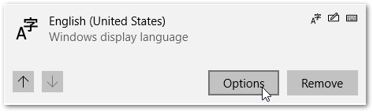
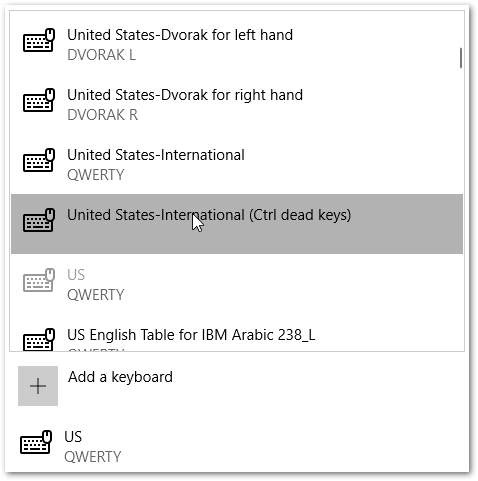

# United States-International Keyboard Layout with Ctrl dead keys

A keyboard layout for Windows that makes it easier to type [diacritic](https://en.wikipedia.org/wiki/Diacritic) marks.

The following diacritics are supported:

| Diacritic    | Example |                                                                                                                                       |
| ------------ | ------- | ------------------------------------------------------------------------------------------------------------------------------------- |
| acute accent | áéíúó   | `Ctrl + '`, `e`                                                                                                                       |
| grave accent | àèìòù   | `` Ctrl + ` ``, `e`                                                                                                                   |
| circumflex   | âêîôû   | `Ctrl + ^`, `e`   _The circumflex is situated above the number `6` so the full keyboard sequence is:   `Ctrl + Shift + 6`, `e`_ |
| umlaut       | äëïöü   | `Ctrl + "`, `e`                                                                                                                       |

## Installation

Download `usintlctrl-v1.0.zip` from the [releases](https://github.com/benfo/usintlctrl/releases/tag/v1.0) page.

Extract the files into a folder and run `setup.exe`.

Open the Language Settings:

- Press `Windows Key` and type `language settings`.
- Locate your current langage and select `Options`.
  
- Add the new keyboard layout by selecting `Add a keyboard`.
  
- You can remove the other keyboard layouts so that you don't have to switch between layouts.
